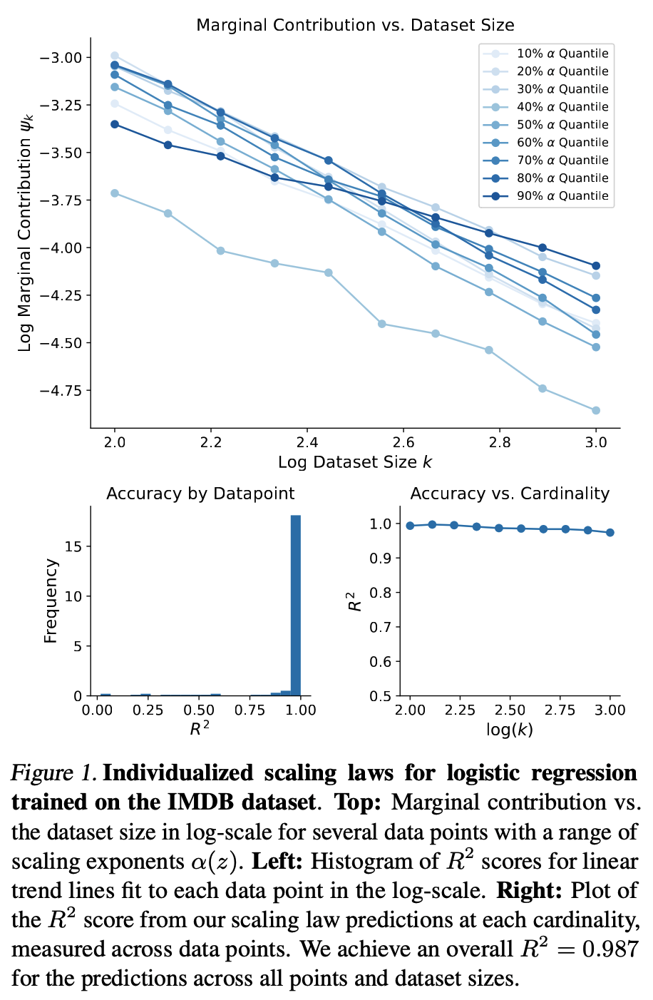
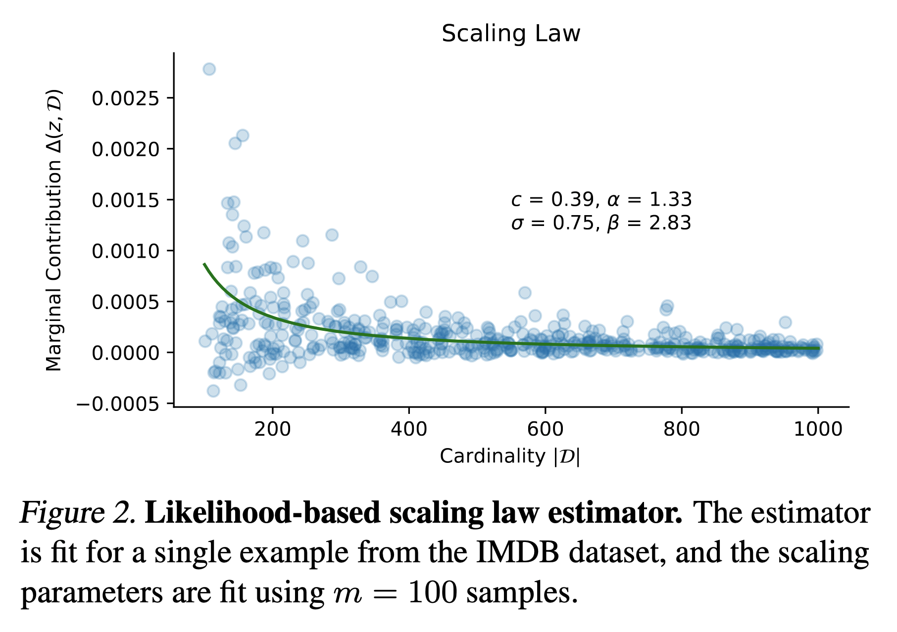

# Individualized data scaling laws

This repository contains code for the paper "Scaling Laws for the Value of Individual Data Points in Machine Learning" (ICML 2024).
The idea is to analyze how each data point's contribution to a model's performance shrinks as a function of the existing dataset size,
which is useful for estimating data valuation scores like Data Shapley and selecting new data points to add to the dataset.

This is an initial work on scaling behavior for individual data points, and future research may help fit the scaling laws
more efficiently and improve their usage for data valuation and dataset curation.

  

<!-- 

    

 -->

# Usage

To use this approach, the first step is to clone the repository and pip install the `data_scaling` module into your Python environment (`pip install .`). This module contains the core functionality for fitting the scaling laws.

Next, running the experiments shown in the paper involves the following steps, all of which are performed in the `experiments` directory:

1. Preprocess the desired dataset using the `preprocess.py` script.
2. Generate marginal contribution samples:
the `generate_samples.py` script generates marginal contributions for each data point to fit the scaling laws,
and `generate_samples_validation.py` generates samples used to validate the scaling laws. (The difference between the two is that the former uses a full range of dataset sizes, say 100-1000 points, while the latter uses a staggered set of dataset sizes to get accurate mean estimates at each size.)
Depending on whether you generate samples using one job or multiple parallel jobs, you may need to combine the results into a single file using the `combine_samples.py` script. **NOTE:** this is the slowest part of the process, fitting the scaling laws is fast once the data is generated.
3. Fit the scaling laws: this can be done with our maximum likelihood estimator using the `scaling_likelihood.py` script,
or with our amortized estimator using the `scaling_amortized.py` script. See Section 3 of the paper for details about each approach.

Next, there are a multiple scripts for visualizing the results:

- `plot_validation.py` reproduces Figure 1 of the paper, where we validate that the scaling law holds and visualize a few $\alpha(z)$ values.
- `plot_histogram.py` can plot a variety of histograms exploring the fitted scaling laws, e.g., showing the distribution of $\alpha(z)$ and $c(z)$ values.
- `plot_distance.py` shows the relationship between $\alpha(z)$ and the distance to the logistic regression decision boundary.
- `plot_scaling_estimates.py` generates multiple results regarding the accuracy of the scaling law's predictions at different dataset sizes,
comparisons between our efficient estimators, and their convergence with more marginal contribution samples.

Additionally, there are two scripts that use the scaling laws for downstream tasks:

- `test_data_valuation.py` compares data valuation accuracy using the scaling law to a conventional Monte Carlo estimator (Section 4.3 of the paper).
- `test_point_addition.py` runs the data selection experiments where high-scoring points are added to a random initial dataset (Section 4.4 of the paper).
